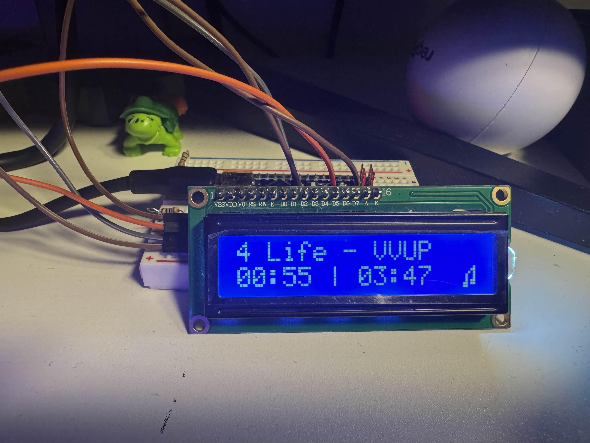
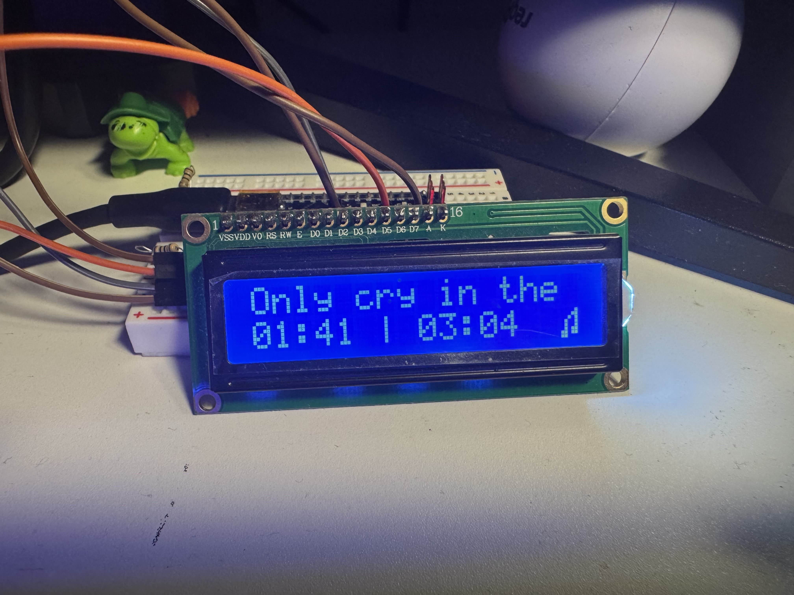
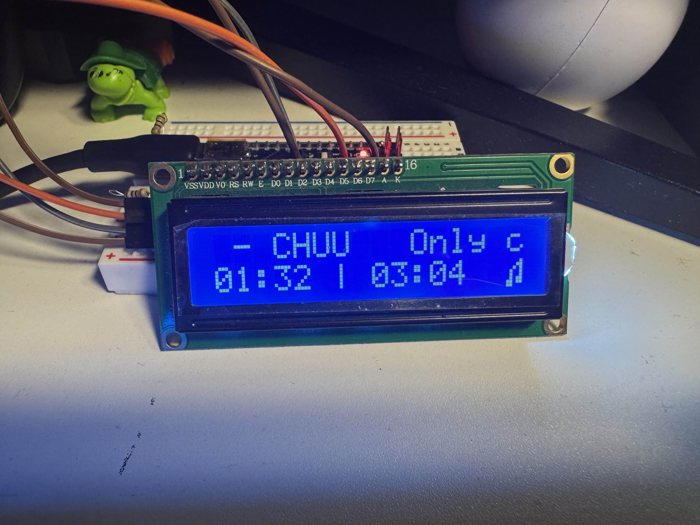
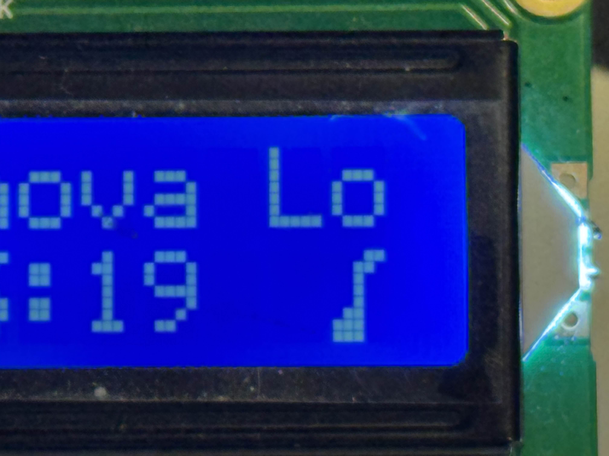
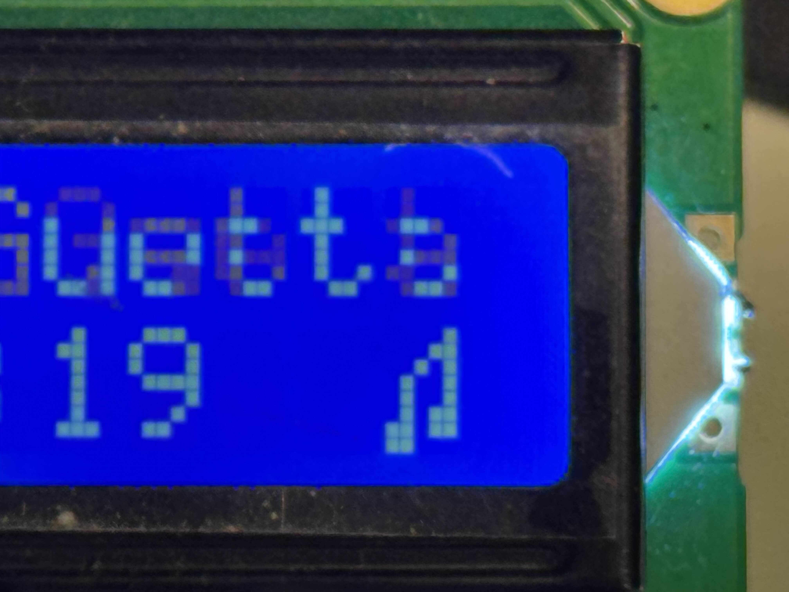

# LCD-Music

## Introduction

This project converts the media information available on a Linux-based machine using playerctl and sends it over Serial to an Arduino. On the Arduino there is a 16x2 LCD connected.

## Features

### Scrolling when the title and artists are longer than the LCD size

### Alternating between music notes

Music Note 1

Music Note 2
